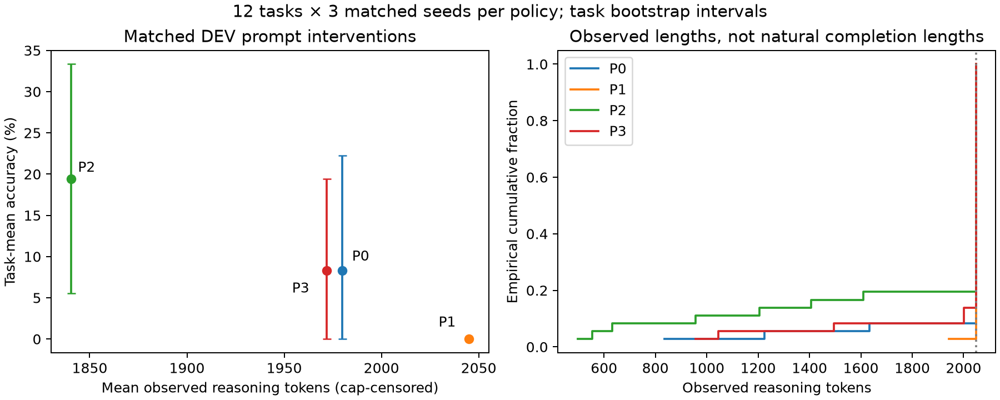

# Prompt-policy ablation

Completed 144 trajectories on twelve DEV tasks, three matched seeds, four policies. Original weights, official thinking sampler, guard off, 2048 total-output cap. No TEST selection.

| Policy | Correct / 36 | EOS | Cap | Median / P95 reasoning | Mean total tokens | Format compliance | Format-meta word density |
|---|---:|---:|---:|---:|---:|---:|---:|
| P0 | 3 / 36 | 3 | 33 | 2048 / 2048 | 1988.2 | n/a | 6.2% |
| P1 | 0 / 36 | 0 | 36 | 2048 / 2048 | 2048.0 | 0.0% | 6.5% |
| P2 | 7 / 36 | 7 | 29 | 2048 / 2048 | 1852.0 | 16.7% | 11.8% |
| P3 | 3 / 36 | 3 | 33 | 2048 / 2048 | 1981.7 | 8.3% | 25.5% |

Provisional DEV policy choice: P2. Selection rule: task accuracy descending, cap rate ascending, format-meta density ascending, mean total output ascending; DEV only.

P0 is bare task; P1 requests step-by-step and boxed answer; P2 requests a final integer-only line; P3 reproduces the historical FINAL wording.

## Seed variation and uncertainty

Replicates are averaged within each task; task bootstrap intervals use twelve clusters, not 36 independent problems. Same task/replicate receives the same seed across policies. Numerical outcome and format adherence are separate. The format-meta metric is a transparent line-cue heuristic, not a semantic oracle; manual validation is recorded separately. Latency is from sequential interleaved policy runs during development, with uncontrolled thermals/background activity.

P0: 2/12 tasks have both correct and incorrect replicates; mean within-task total-token SD 69.8. Task-bootstrap accuracy interval: [0.0, 0.2222222222222222].
P1: 0/12 tasks have both correct and incorrect replicates; mean within-task total-token SD 0.0. Task-bootstrap accuracy interval: [0.0, 0.0].
P2: 5/12 tasks have both correct and incorrect replicates; mean within-task total-token SD 224.0. Task-bootstrap accuracy interval: [0.05555555555555555, 0.3333333333333333].
P3: 2/12 tasks have both correct and incorrect replicates; mean within-task total-token SD 55.0. Task-bootstrap accuracy interval: [0.0, 0.19444444444444445].

## Reproduction

```bash
uv sync --frozen
uv run --frozen python scripts/prompt_policy_ablation.py
# Interrupted run: reuse exactly its saved config and dataset.
uv run --frozen python scripts/prompt_policy_ablation.py --resume runs/<run>
```

Full local source: `runs/20261005T193609-phase2-prompt-policy-8fdc19d6`. Inspectable raw text, tokens, policies, seeds and metrics are committed in prompt_policy_records.jsonl. Historical v1 stimuli and v5 results are unchanged.

## Interpretation and checkpoint

P2 has four more correct trajectories than P3 (+11.1 percentage points; paired
task-bootstrap interval 0–22.2 points). Mean total output falls by 129.7 tokens
(6.5%), with a paired task-bootstrap interval of −241.2 to −30.0 tokens. Median
and p95 reasoning remain capped, and 29/36 P2 traces still truncate. This does not
establish a general capability-preserving efficiency gain. P0 still caps 33/36;
boxed P1 caps every trajectory. Formatting is a real amplifier in reviewed legacy
traces, while content confusion, arithmetic drift and repeated reconsideration
remain under other policies. Seed variation prevents interpreting a single
trajectory as typical behavior.

All twelve P3 replicate-zero controls reproduced the original stock baseline’s
emitted token sequences exactly. Historical v1 stimuli and v5 results are unchanged;
new scoring is separately identified as v6. All thirteen EOS completions are
correct, so wrong-final degradation was not observed in this study. A bare-prompt
arithmetic trace reaches 2006 and later contradicts it before truncating; this is
intermediate drift, not a measured wrong final answer.

The raw broad format-meta v1 fields remain unchanged. The derived anchored v2
analysis and twelve individually reviewed traces distinguish task-rule confusion
from actual output-format discussion. V2 was designed using the initial eight
traces and has limited curated extension review; it is not an independent oracle.
Thirty-six lexical pair judgments are measured separately. Semantic encoder
inference, higher-cap completion and counterfactual probes have not run yet.



Work stops here at the user’s requested milestone. See
[complete checkpoint and exact next experiment](phase2_checkpoint.md),
[control reproduction](control_reproduction.json) and
[process/history audit](phase2_stop_audit.json). No model job is queued, no new
TRAIN responses or optimizer steps exist, and native 262144-token context/RoPE
remain unchanged. Boundary bootstrap intervals (notably P1) must not be interpreted
as zero population uncertainty.
